# 手把手教你开发Vue插件

## 第一步：
### 检查npm中插件名称是否被占用
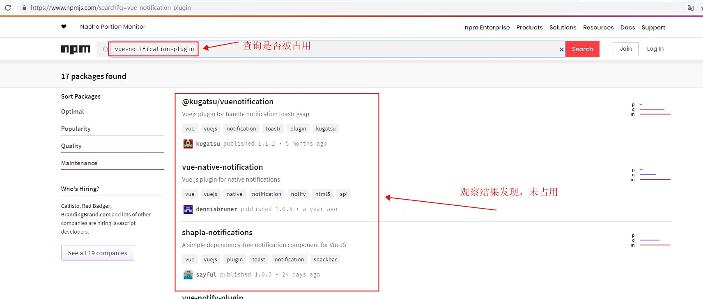

### 检查项目名称在github中是否被占用
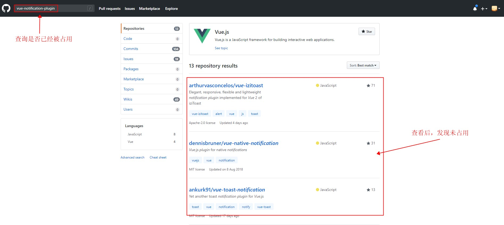

## 第二步：
### github创建项目
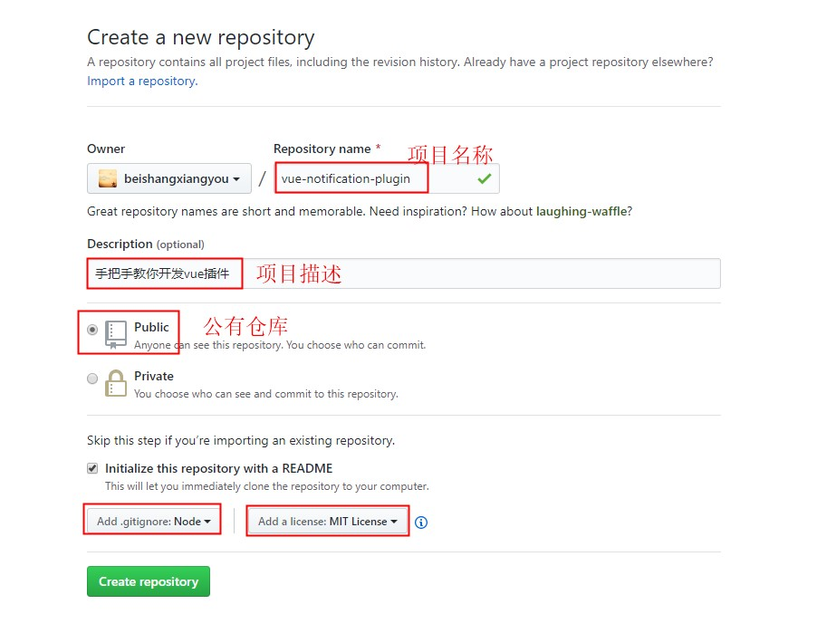

## 第三步：
### 创建本地项目
```bash
vue init webpack-simple vue-notification-plugin //报错
npm install -g @vue/cli-init // 安装vue-cli3.0版本后，如果想使用vue init，需要安装@vue/cli-init
```
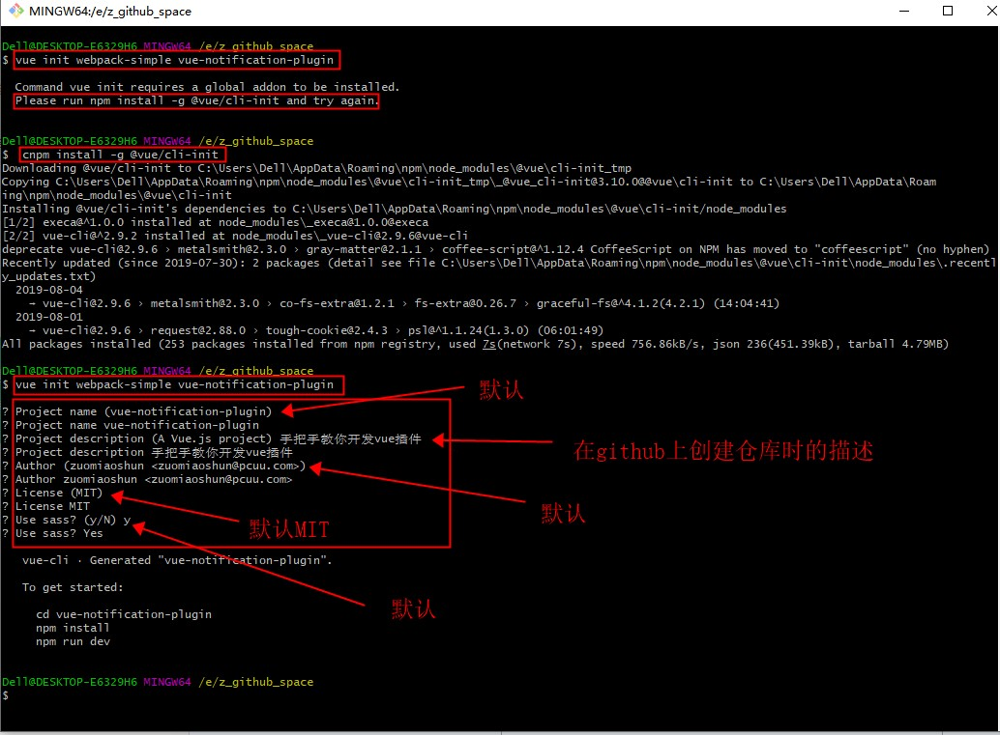

```bash
cd vue-notification-plugin
npm install
npm run dev
```
### 在浏览器中访问http://localhost:8082，端口以实际端口为准

## 第四步：
### 关联远程仓库
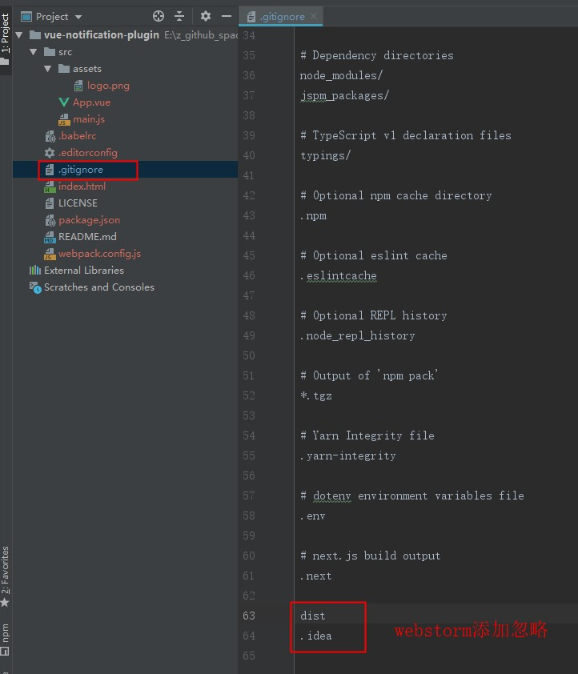
```javascript

```
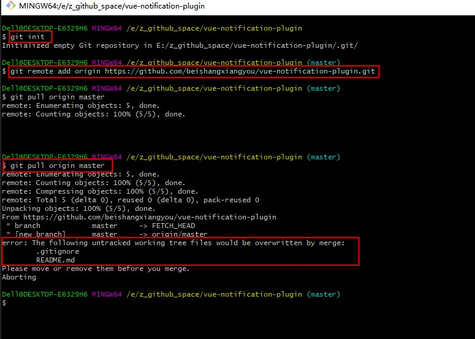
```bash
rm -rf .gitignore
rm -rf README.md
// 删除后重新执行
git pull origin master
```
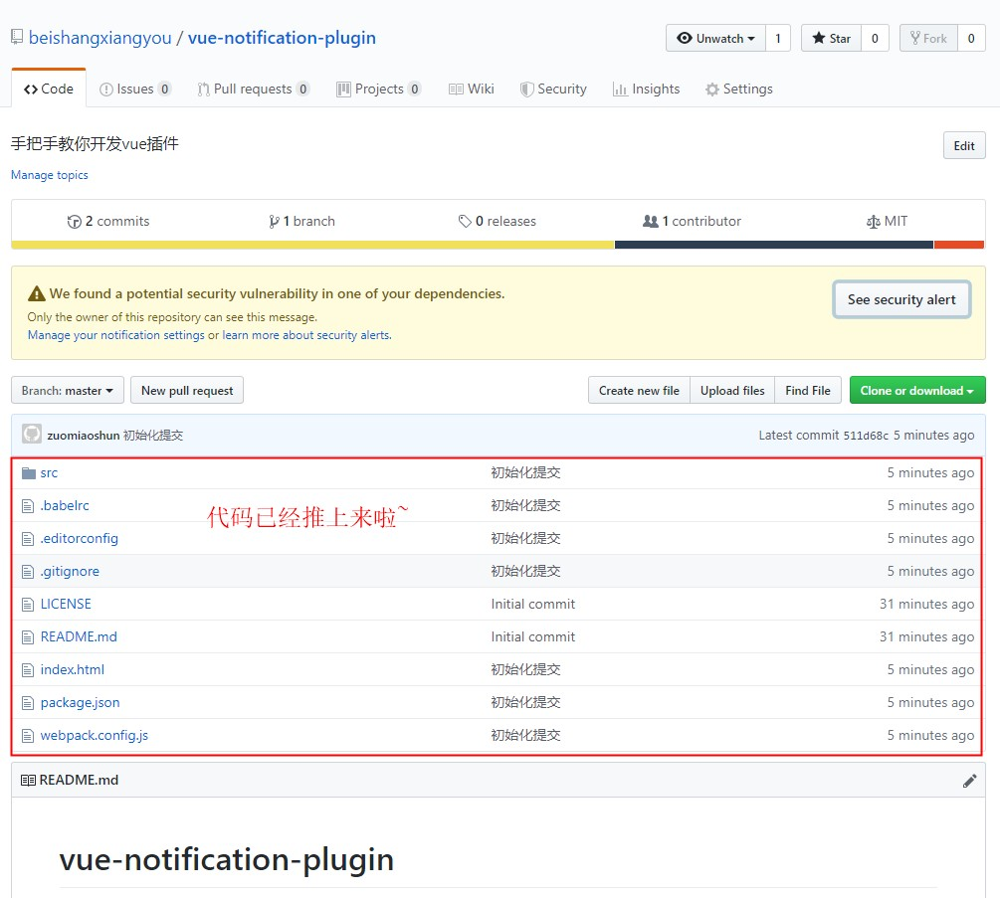
```javascript

```

## 第五步：todo...

## 第六步：
### 改造webpack.config.js
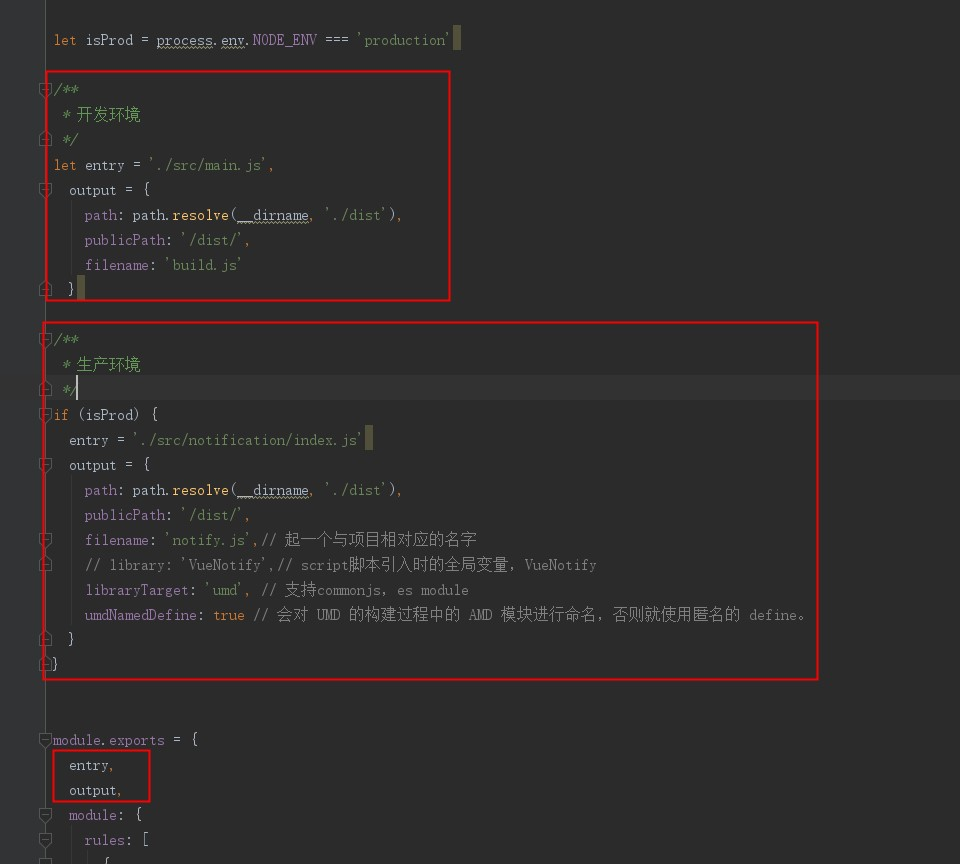
### 改造package.json


## 第七步：
### 发布至npm
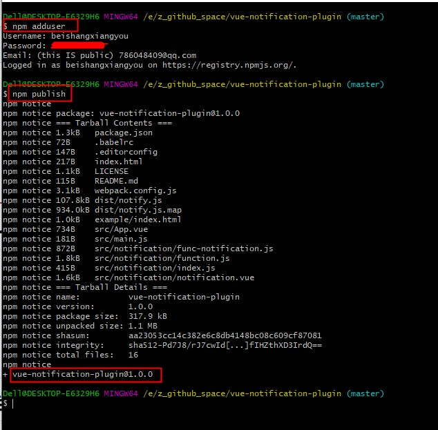
```bash
如果你还没有npm账号，记得注册哦~~
```
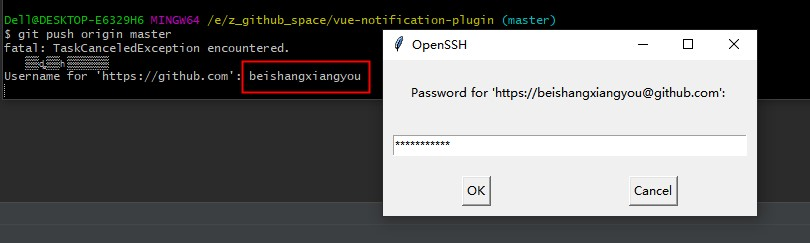
```bash
如果有报错，请查看是否npm源错误，比如切换成了淘宝镜像
```
### 查看发布
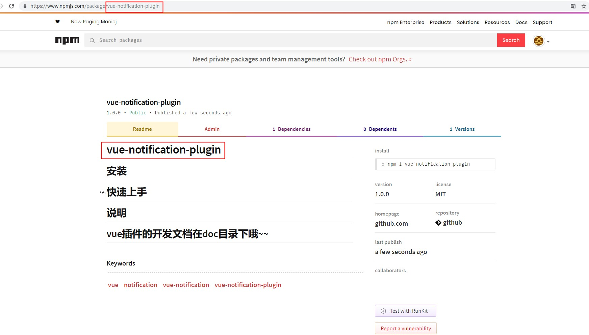

## 至此，我们已经发布了第一版，接下来就是继续晚上文档和插件本身了哦~~


